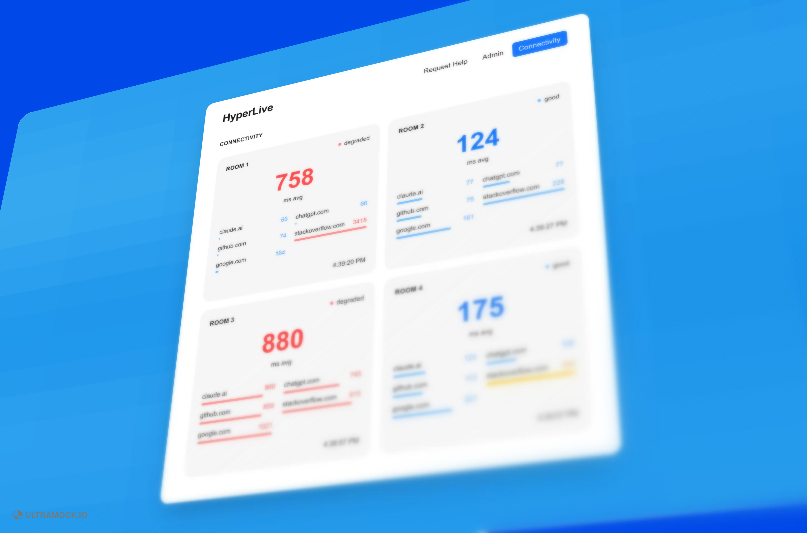
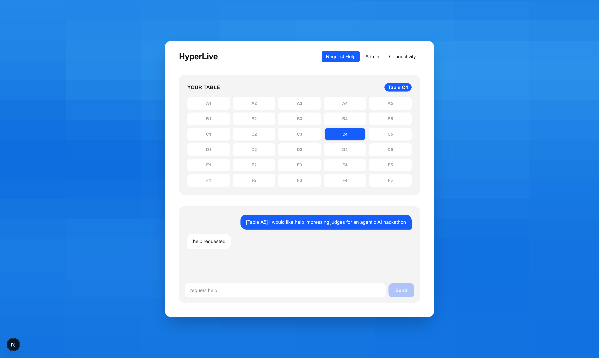
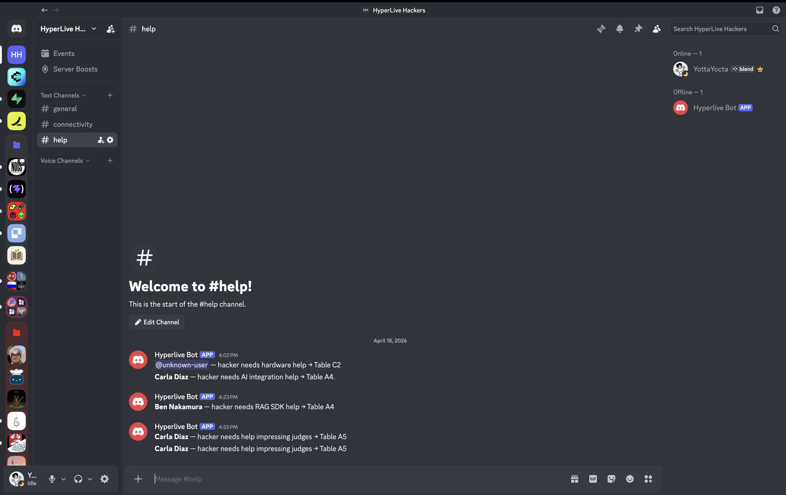
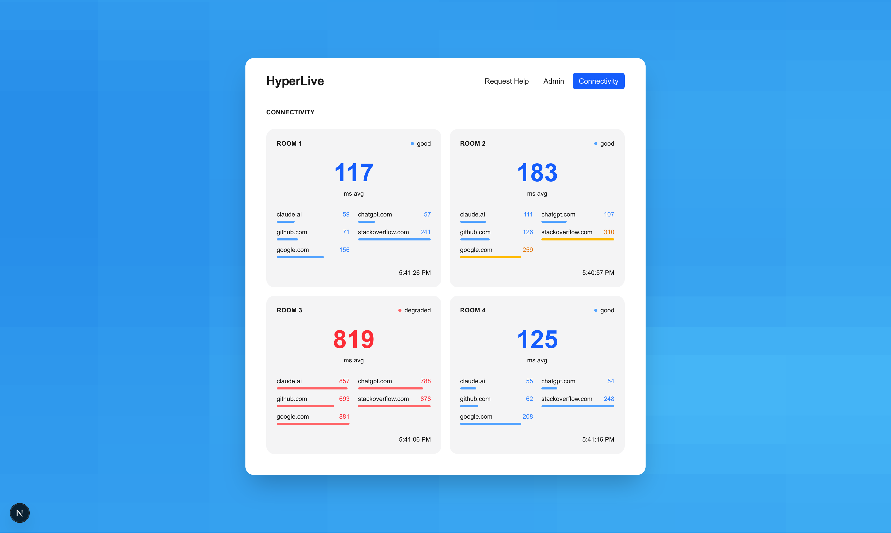
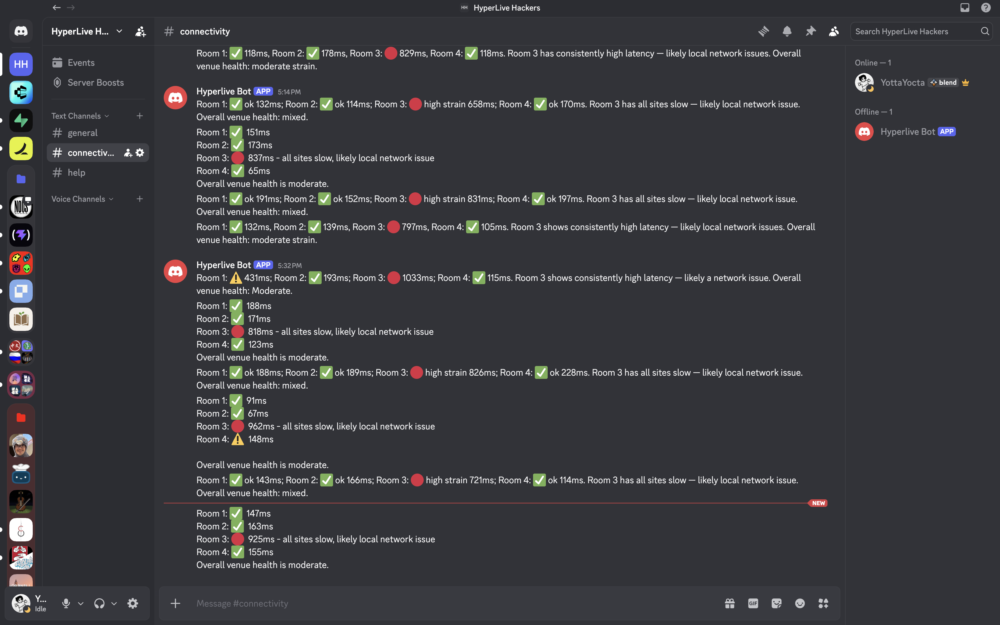
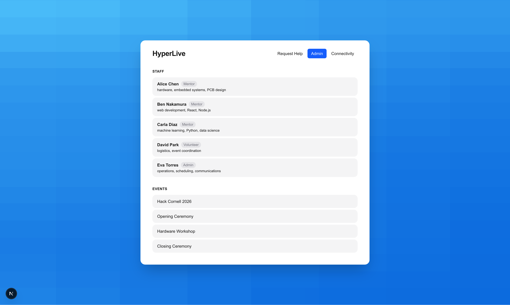

This is a [Next.js](https://nextjs.org) project bootstrapped with [`create-next-app`](https://nextjs.org/docs/app/api-reference/cli/create-next-app).

## Getting Started

First, run the development server:

```bash
npm run dev
# or
yarn dev
# or
pnpm dev
# or
bun dev
```

Open [http://localhost:3000](http://localhost:3000) with your browser to see the result.

You can start editing the page by modifying `app/page.tsx`. The page auto-updates as you edit the file.

This project uses [`next/font`](https://nextjs.org/docs/app/building-your-application/optimizing/fonts) to automatically optimize and load [Geist](https://vercel.com/font), a new font family for Vercel.

## Learn More

To learn more about Next.js, take a look at the following resources:

- [Next.js Documentation](https://nextjs.org/docs) - learn about Next.js features and API.
- [Learn Next.js](https://nextjs.org/learn) - an interactive Next.js tutorial.

You can check out [the Next.js GitHub repository](https://github.com/vercel/next.js) - your feedback and contributions are welcome!

## Deploy on Vercel

The easiest way to deploy your Next.js app is to use the [Vercel Platform](https://vercel.com/new?utm_medium=default-template&filter=next.js&utm_source=create-next-app&utm_campaign=create-next-app-readme) from the creators of Next.js.

Check out our [Next.js deployment documentation](https://nextjs.org/docs/app/building-your-application/deploying) for more details.

---

## Screenshots

### App — Hero



### App — Dashboard


### Help Request



### Discord — Help Dispatch



### Connectivity — App View



### Connectivity — Discord Alert



### Admin — Team View



---

## Demo Script

**The problem.**
Running a hackathon means hundreds of people in one room — participants stuck on problems, mentors scattered around, organizers with no visibility into what's breaking or who needs help. Everything is reactive, manual, and too slow.

**What HyperLive does.**
HyperLive is a real-time operations layer for live events. Participants open the dashboard, select their table, and describe what they need. That request is immediately stored and broadcast. An AI agent running on a cron job reads the queue, matches each request to the right mentor by expertise, and posts a targeted Discord message — by name, with the table number — so the right person knows exactly where to go. Meanwhile, a second agent continuously probes internet connectivity across all rooms in the venue, detects degraded connections, and posts automatic warnings to Discord before anyone has to notice and report it.

**The tech.**
- **Next.js** frontend with a shared React context store — state persists across tabs without a database.
- **Express** Discord bot exposing a REST API: help request queue, team roster, channel messaging, and connectivity data — all tunnelled publicly via ngrok.
- **Ara** AI agents: two automations running on cron schedules. One scans and dispatches help requests using tool calls to fetch the queue, match mentors, post to Discord, and mark requests handled. The other probes five URLs per room, computes average latency, and flags strain patterns in plain English.
- **WebGL shader pipeline** (Sequenza) renders an animated FBM noise field with pixellation and gradient mapping as the live background.
